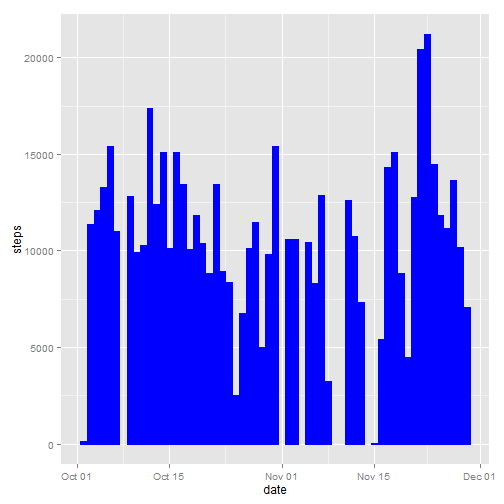
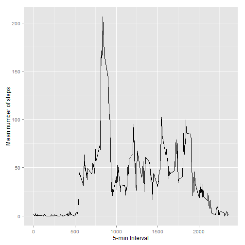
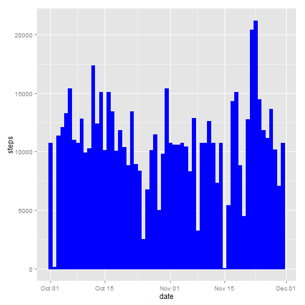
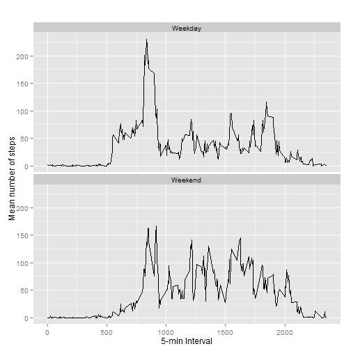

# Reproducible Research: Peer Assessment 1


```r
library(ggplot2)
```

## Loading and preprocessing the data


```r
activity <- read.csv("activity.csv", colClasses = c("numeric","Date","numeric"))
```
                                                    
## What is mean total number of steps taken per day?

Make a histogram of the total number of steps taken each day

```r
gg <- ggplot(activity,aes(x=date,y=steps))+geom_histogram(colour="blue", fill="blue", stat="identity")
print(gg)
```

```
## Warning: Removed 2304 rows containing missing values (position_stack).
```

 

Calculate and report the mean and median total number of steps taken per day

```r
total.steps <- tapply(activity$steps, activity$date, sum, na.rm=TRUE)
mean.steps = mean(total.steps)
median.steps = median(total.steps)
mean.steps
```

```
## [1] 9354
```

```r
median.steps
```

```
## [1] 10395
```

## What is the average daily activity pattern?

```r
steps.int.mean <- tapply(activity$steps, activity$interval, mean, na.rm=TRUE)
pattern <- data.frame(interval=as.numeric(names(steps.int.mean)),steps.int.mean=steps.int.mean)
print(ggplot(pattern, aes(x=interval, y=steps.int.mean)) + geom_line(aes(group=1)) +
        xlab('5-min Interval') + ylab('Mean number of steps') +   
        scale_x_continuous(breaks=c(seq(0,2500,by=500))))
```

 

```r
most <- which.max(pattern$steps.int.mean)
print(sprintf('The interval with the highest mean number of steps is: %3.0f', pattern[most,'interval']))
```

```
## [1] "The interval with the highest mean number of steps is: 835"
```

## Imputing missing values
Calculate and report the total number of missing values in the dataset (i.e. the total number of rows with NAs). See "NA's" in the following summary:

```r
print(summary(activity$steps))
```

```
##    Min. 1st Qu.  Median    Mean 3rd Qu.    Max.    NA's 
##     0.0     0.0     0.0    37.4    12.0   806.0    2304
```

Create a new dataset that is equal to the original dataset. 
The missing data is filled in with the mean for that 5-minute interval across all days.

```r
activity.new <- activity
activity.new <- merge(activity.new, pattern, by="interval")
y <- is.na(activity.new$steps)
activity.new$steps[y] <- activity.new$steps.int.mean[y]
activity.new <- activity.new[, c(1:3)]
```

Make a histogram of the total number of steps taken each day for the new dataset

```r
gg2 <- ggplot(activity.new,aes(x=date,y=steps))+geom_histogram(colour="blue", fill="blue", stat="identity")
print(gg2)
```

 

Calculate and report the mean and median total number of steps taken per day for the new dataset

```r
total.steps.new <- tapply(activity.new$steps, activity.new$date, sum, na.rm=TRUE)
mean.steps.new = mean(total.steps.new)
median.steps.new = median(total.steps.new)
mean.steps.new
```

```
## [1] 10766
```

```r
median.steps.new
```

```
## [1] 10766
```

## Are there differences in activity patterns between weekdays and weekends?
Convert date from string to Date class. Add and set daytype column. Aggregate and print.

```r
activity.new$date <- as.Date(activity.new$date, "%Y-%m-%d")
activity.new$daytype <- c("Weekday")
for (i in 1:nrow(activity.new)){
  if (weekdays(activity.new$date[i]) %in% c("Saturday","Sunday")){
    activity.new$daytype[i] <- "Weekend"
  }
}

activity.new$daytype <- as.factor(activity.new$daytype)
interval.steps <- aggregate(steps ~ interval+daytype, activity.new, mean)
qplot(interval, steps, data=interval.steps, geom=c("line"), xlab="5-min Interval", 
      ylab="Mean number of steps", main="") + facet_wrap(~ daytype, ncol=1)
```

 
